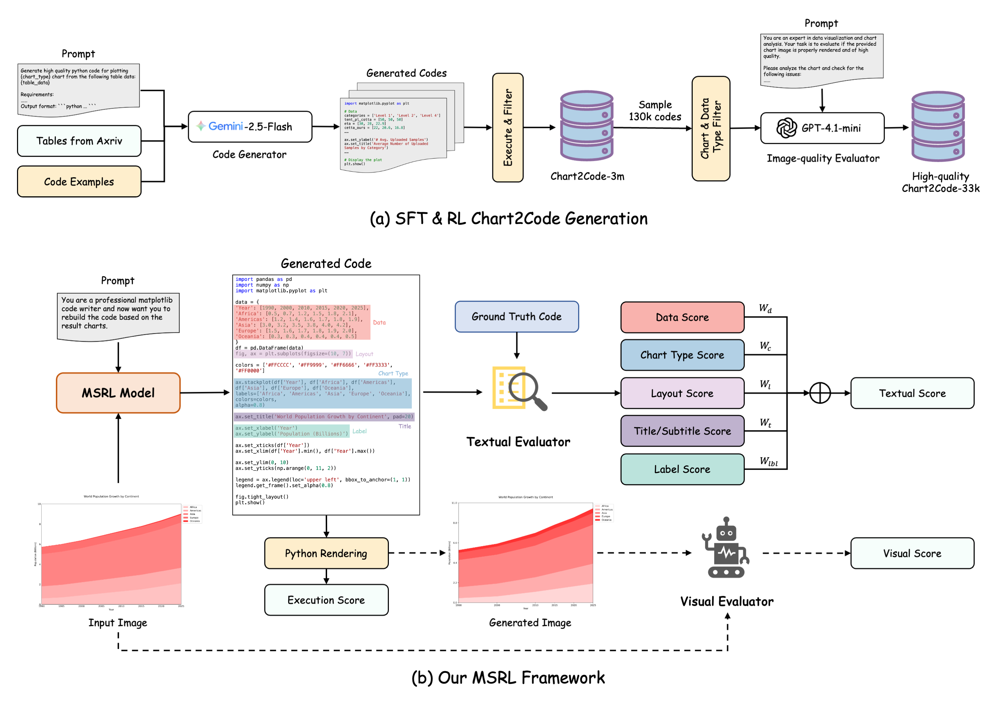

<div align="center">
  <h1>Breaking the SFT Plateau: Multimodal Structured Reinforcement Learning for Chart-to-Code Generation</h1>
</div>

<div align="center">
<a href='https://arxiv.org/abs/2508.13587'></a>&ensp;<a href='https://huggingface.co/collections/DocTron/msrl-68ad19f014e40d69667a0c23'></a>&ensp;<a href=https://github.com/tatsu-lab/stanford_alpaca/blob/main/LICENSE></a>

Lei Chen, Xuanle Zhao, Zhixiong Zeng†, Jing Huang, Liming Zheng, Yufeng Zhong, Lin Ma*
</div>
<div align="center">
<strong>Meituan Group</strong>
</div>
<div align="center">
† Project Leader; * Corresponding Author
</div>


---
**MSRL (Multimodal Structured Reinforcement Learning)** is a reinforcement learning strategy designed to break through the SFT performance plateau in chart-to-code generation. As the **first** method applying multimodal structured rewards to this domain, MSRL addresses limitations in handling information-dense visual inputs through an innovative multi-granularity reward system. The approach combines rule-based textual rewards that validate code correctness from five key dimensions with visual rewards using a "render-and-compare" mechanism to assess structural similarity between generated and original charts. MSRL employs a two-stage curriculum learning strategy, training initially on textual rewards before incorporating visual signals. Experimental results show MSRL improves the high-level metrics by 6.2% and 9.9% on ChartMimic and ReachQA benchmarks respectively, marking the **first time** open-source models achieve competitive performance with advanced closed-source models in the chart domain.
<div align="center">

</div>


## 📢 News and Updates
* ```2025.08.26``` We upload our model weights [MSRL](https://huggingface.co/DocTron/MSRL) and [MSRL-SFT](https://huggingface.co/DocTron/MSRL-SFT) to HuggingFace.
* ```2025.08.19``` 🔥🔥🔥 We release the technical report of **MSRL** at arXiv [link](https://arxiv.org/abs/2507.15509).


## 🤗 Models
|  Model   | Download Link  |
|  ----  | ----  |
|  MSRL-SFT |  [DocTron/MSRL-SFT](https://huggingface.co/DocTron/MSRL-SFT)  |
|  MSRL  |  [DocTron/MSRL](https://huggingface.co/DocTron/MSRL)   |

The ```MSRL-SFT``` employs Qwen2.5VL-7B-Instruct as the initial model and performs supervised fine-tuning with a 2.8M Chart2Code dataset. The ```MSRL``` builds upon the SFT model and undergoes two-stage RL training using a high-quality 33K Chart2Code dataset.


## 📊 Performance
<table>
<thead>
  <tr>
    <th rowspan="2">Model</th>
    <th rowspan="2">Params</th>
    <th colspan="3">ChartMimic</th>
    <th colspan="3">ReachQA</th>
  </tr>
  <tr>
    <th>Exec.Rate</th>
    <th>Low-Level</th>
    <th>High-Level</th>
    <th>Exec.Rate</th>
    <th>Low-Level</th>
    <th>High-Level</th>
  </tr>
</thead>
<tbody>
  <tr>
    <td colspan="8"><i>Proprietary</i></td>
  </tr>
  <tr>
    <td>GeminiProVision</td>
    <td>-</td>
    <td>68.2</td>
    <td>53.8</td>
    <td>53.3</td>
    <td>74.0</td>
    <td>67.0</td>
    <td>67.8</td>
  </tr>
  <tr>
    <td>Claude-3-opus</td>
    <td>-</td>
    <td>83.3</td>
    <td>60.5</td>
    <td>60.1</td>
    <td>89.0</td>
    <td>51.7</td>
    <td>61.1</td>
  </tr>
  <tr>
    <td>GPT-4V</td>
    <td>-</td>
    <td>91.2</td>
    <td>76.4</td>
    <td>78.9</td>
    <td>88.0</td>
    <td>69.5</td>
    <td>78.6</td>
  </tr>
  <tr>
    <td>GPT-4o</td>
    <td>-</td>
    <td>93.2</td>
    <td><b>79.0</b></td>
    <td>83.5</td>
    <td>92.8</td>
    <td>81.8</td>
    <td>84.0</td>
  </tr>
  <tr>
    <td colspan="8"><i>Open-Source General-Domain</i></td>
  </tr>
  <tr>
    <td>Qwen2-VL-7B</td>
    <td>7B</td>
    <td>67.0</td>
    <td>32.9</td>
    <td>35.0</td>
    <td>55.4</td>
    <td>22.6</td>
    <td>29.3</td>
  </tr>
  <tr>
    <td>Qwen2.5-VL-7B</td>
    <td>7B</td>
    <td>73.2</td>
    <td>44.6</td>
    <td>41.6</td>
    <td>62.2</td>
    <td>36.9</td>
    <td>37.6</td>
  </tr>
  <tr>
    <td>InternVL2-8B</td>
    <td>8B</td>
    <td>61.8</td>
    <td>34.4</td>
    <td>38.9</td>
    <td>50.8</td>
    <td>24.1</td>
    <td>24.2</td>
  </tr>
  <tr>
    <td>InternVL2-26B</td>
    <td>26B</td>
    <td>69.3</td>
    <td>41.4</td>
    <td>47.4</td>
    <td>55.4</td>
    <td>29.0</td>
    <td>28.8</td>
  </tr>
  <tr>
    <td>Qwen2-VL-72B</td>
    <td>72B</td>
    <td>73.3</td>
    <td>54.4</td>
    <td>50.9</td>
    <td>77.2</td>
    <td>50.0</td>
    <td>48.1</td>
  </tr>
  <tr>
    <td colspan="8"><i>Open-Source Chart-Domain</i></td>
  </tr>
  <tr>
    <td>ChartLlama</td>
    <td>13B</td>
    <td>57.5</td>
    <td>24.8</td>
    <td>28.1</td>
    <td>54.8</td>
    <td>11.1</td>
    <td>8.1</td>
  </tr>
  <tr>
    <td>TinyChart</td>
    <td>3B</td>
    <td>42.5</td>
    <td>26.3</td>
    <td>25.9</td>
    <td>34.4</td>
    <td>11.6</td>
    <td>11.2</td>
  </tr>
  <tr>
    <td>ChartVLM-L</td>
    <td>14B</td>
    <td>19.5</td>
    <td>15.8</td>
    <td>13.9</td>
    <td>8.2</td>
    <td>2.1</td>
    <td>3.9</td>
  </tr>
  <tr>
    <td>Chart2Code</td>
    <td>7B</td>
    <td>62.1</td>
    <td>42.9</td>
    <td>33.3</td>
    <td>63.6</td>
    <td>52.3</td>
    <td>49.7</td>
  </tr>
  <tr>
    <td>ChartCoder</td>
    <td>7B</td>
    <td>91.4</td>
    <td>72.5<sup>‡</sup></td>
    <td>74.0</td>
    <td>83.8</td>
    <td>67.9</td>
    <td>69.4</td>
  </tr>
  <tr>
    <td>MSRL-SFT</td>
    <td>7B</td>
    <td>93.2</td>
    <td>73.0</td>
    <td>77.6</td>
    <td>92.2</td>
    <td>78.6</td>
    <td>80.0</td>
  </tr>
  <tr>
    <td>MSRL</td>
    <td>7B</td>
    <td><b>96.5</b></td>
    <td>78.6</td>
    <td><b>83.8</b></td>
    <td><b>98.2</b></td>
    <td><b>86.1</b></td>
    <td><b>89.9</b></td>
  </tr>
</tbody>
</table>


## 🔍 Usage Example
Below is an example of how to use MSRL for chart-to-code generation:
```python
from transformers import Qwen2_5_VLForConditionalGeneration, AutoProcessor
from qwen_vl_utils import process_vision_info

# Load model
model_path = 'DocTron/MSRL'
# model_path = 'DocTron/MSRL-SFT'

# Load the model on the available device(s)
model = Qwen2_5_VLForConditionalGeneration.from_pretrained(model_path, torch_dtype="auto", device_map="cuda")

# Use the following instruction and pixel range by default
instruction = """
You are an expert Python developer who specializes in writing matplotlib code based on a given picture. I found a very nice picture in a STEM paper, but there is no corresponding source code available. I need your help to generate the Python code that can reproduce the picture based on the picture I provide.
Now, please give me the matplotlib code that reproduces the picture below, starting with "```python" and ending with "```".
"""

processor = AutoProcessor.from_pretrained(model_path, min_pixels=1280*28*28, max_pixels=16384*28*28)

# Prepare input with image and text
messages = [
    {"role": "user", "content": [
            {"type": "image", "image": "assets/example_case.jpg"},
            {"type": "text", "text": instruction},
        ]
    },
]

# Preparation for inference
text = processor.apply_chat_template(messages, tokenize=False, add_generation_prompt=True)
images, videos = process_vision_info([messages])
inputs = processor(text=text, images=images, videos=videos, padding=True, return_tensors='pt')
inputs = inputs.to(model.device)

# Inference: Generation of the output
generated_ids = model.generate(**inputs, max_new_tokens=4096, top_p=1, temperature=0.1)
generated_ids = [
    output_ids[len(input_ids):] for input_ids, output_ids in zip(inputs.input_ids, generated_ids)
]
generated_code = processor.tokenizer.batch_decode(
    generated_ids, skip_special_tokens=True, clean_up_tokenization_spaces=False
)[0]
print(generated_code)
```

## 📌 Acknowledgement
We sincerely appreciate [LLaMA-Factory](https://github.com/hiyouga/LLaMA-Factory) and [MM-EUREKA](https://github.com/ModalMinds/MM-EUREKA) for providing reference training framework.


## 📖 Citation
If you find this project useful, please feel free to leave a star and cite our paper:
```
@misc{chen2025breaking,
      title={Breaking the SFT Plateau: Multimodal Structured Reinforcement Learning for Chart-to-Code Generation}, 
      author={Lei Chen and Xuanle Zhao and Zhixiong Zeng and Jing Huang and Liming Zheng and Yufeng Zhong and Lin Ma},
      year={2025},
      eprint={2508.13587},
      archivePrefix={arXiv},
      primaryClass={cs.AI},
      url={https://arxiv.org/abs/2508.13587}, 
}
```